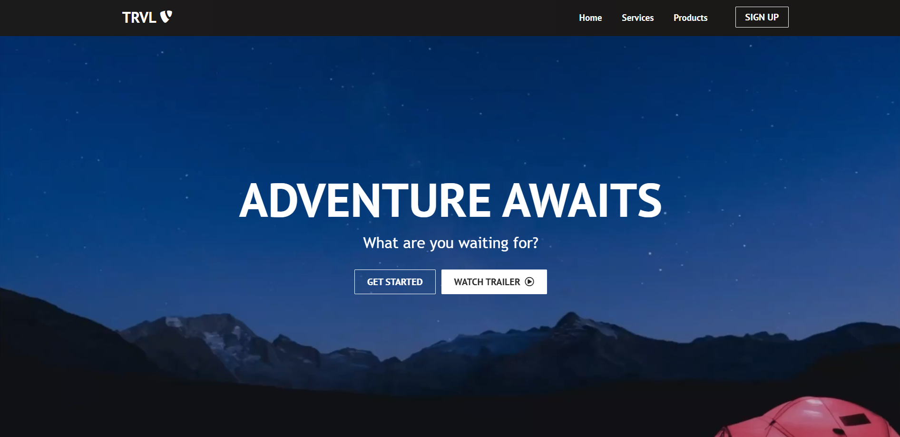
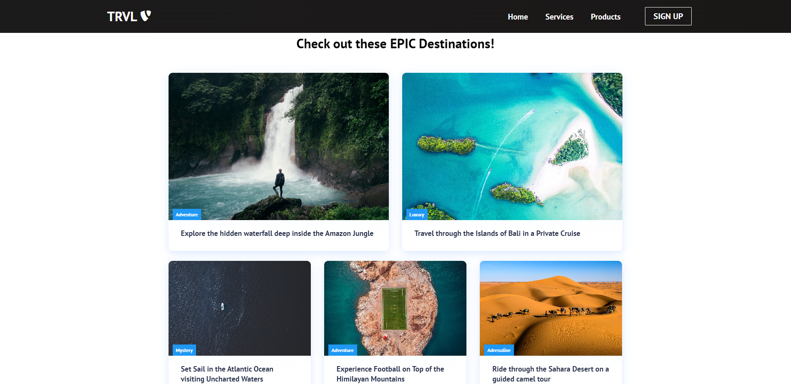
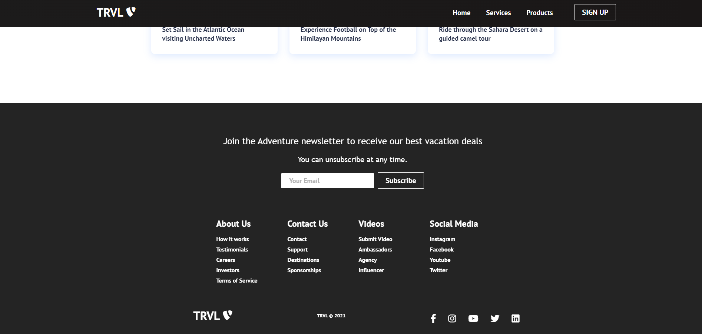
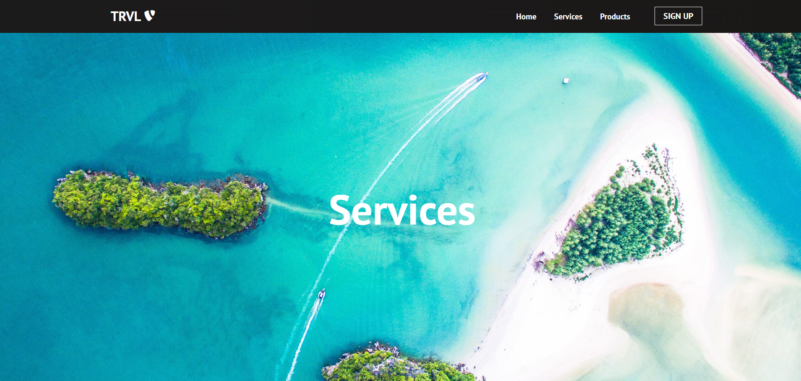

<h1 align="center" id="top">TRVL-landing-page</h1>
&#xa0;
<div align="center">
<a href="https://trvl-landing-page.vercel.app/">Production</a>
</div>
&#xa0;
<p align="center">
  

  

  

  <!--  -->

  <!--  -->

  <!--  -->

  
</p>

<!-- Status -->

<!-- <h4 align="center">
	🚧  Youtube Search 🚀 Under construction...  🚧
</h4>

<hr> -->

<p align="center">
  <a href="#dart-about">About</a> &#xa0; | &#xa0; 
  <a href="#rocket-technologies">Technologies</a> &#xa0; | &#xa0;
  <a href="#white_check_mark-requirements">Requirements</a> &#xa0; | &#xa0;
  <a href="#checkered_flag-starting">Starting</a> &#xa0; | &#xa0;
  <a href="#memo-screenshots">Screenshots</a> &#xa0; | &#xa0;
  <a href="#memo-contact">Author</a> 
</p>

<br>

## :dart: About

Fully responsible landing page that was bootstrapped by React.

## :rocket: Technologies

The following tools were used in this project:

- [React](https://pt-br.reactjs.org/)
- [React Router Dom](https://reactrouter.com/en/main)

## :white_check_mark: Requirements

Before starting :checkered_flag:, you need to have [Git](https://git-scm.com) and [Node](https://nodejs.org/en/) installed.

## :checkered_flag: Starting

```bash
# Clone this project
$ git clone https://github.com/RahymCharyyev/TRVL-landing-page

# Access
$ cd TRVL-landing-page

# Install dependencies
$ npm install

```

```bash

# Run the project

$ npm start

# The server will initialize in the <http://localhost:4000>

```

## :memo: Screenshots

 \
&#xa0;
 \
&#xa0;
 \
&#xa0;
 \
&#xa0;

## :memo: Contact

For any inquiries or questions, please contact <a href="https://github.com/RahymCharyyev" target="_blank">Rahym Charyyev</a>

&#xa0;

<a href="#top">Back to top</a>
